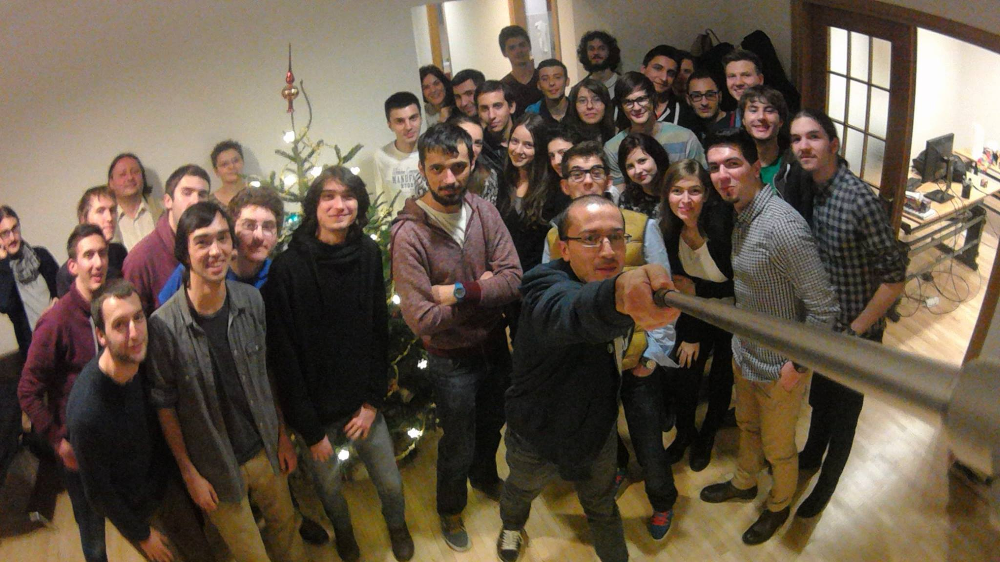

Semestrul acesta [Eau de Web](http://www.eaudeweb.ro/) a colaborat cu Universitatea din București, mai exact cu [Facultatea de Matematică și Informatică](fmi.unibuc.ro/ro), la elaborarea unui curs de Python. O premieră pentru curriculum facultății.
Iulia Chiriac, unul dintre organizatori Pure Python, ne-a povestit despre proiect.

----

Cursul de web development PurePython s-a ținut în această toamnă, la Universitatea București, pe parcursul a nouă săptămâni, cea de-a zecea săptămână fiind rezervată unui hackaton de o zi. Au participat 30 de studenți din anii II și III, dintre care 25 au primit diploma de absolvire.  

#### Organizare

Cursul a fost elaborat de Eau de Web în colaborare cu ROSEdu, cei implicați fiind:
  - Alex Eftimie (organizare, supervizare, training),
  - Iulia Chiriac (organizare, training, prezentări, proces de selecție, redactare cursuri & teme, corectare teme),
  - Mihai Zamfir (training, redactare cursuri & teme, prezentări, corectare teme),
  - Vitalie Maldur (training, redactare teme, corectare teme),
  - Mihai Bivol  (training, redactare cursuri, prezentări),
  - Valentin Popescu (training, design materiale curs),
  - Claudia Ifrim (training),
  - Taygun Agiali (training),
  - Alex Palcuie (training),
  - Iulia Pașov (proces de selecție, redactare cursuri),
  - Dragoș Catarahia (training).

#### Curs

Cursul a fost structura în 4 părți:
  - limbajul de programare Python (4 cursuri): în această parte studenții au primit teme săptămânal
  - framework-ul web Django (4 cursuri): s-au prezentat noțiuni de dezvoltare web & noțiuni specifice framework-ului, cu aplicabilitate, dezvoltându-se pas cu pas o clonă Facebook
  - frontend (1 curs): html, css, js + bootstrap cu care s-a stilizat aplicația dezvoltată până în acest punct
  - hackathon (1 zi)

Cursurile din universitate au avut o durată de două ore (8-10 AM în fiecare marți) și următoarea structură:
  - prezentare concepte noi (30-60 min)
  - [eventual] rezolvarea și explicarea temei de la cursul anterior (~30min)
  - rezolvarea de exerciții care a ajutat la asimilarea noilor concepte

#### Hackathon

Hackathon-ul s-a desfășurat la sediul Eau de Web sâmbătă, 13 decembrie. În cadrul acestuia, studenții au fost împărțiți în echipe de 3-4 persoane și au lucrat la aplicațiile de la curs sau la aplicații noi. 
La sfârșit și-au prezentat cu toții proiectele și au primit diplomele de absolvire.

#### Feedback

Feedback-ul studenților a fost în general bun, sugestiile de îmbunătățire fiind: 
     - oră mai târzie pentru curs, 
     - întâlniri mai dese și/sau mai lungi, 
     - mai mult timp dedicat lucrurilor complet noi (Django, Git), 
     - abordarea de subiecte mai complexe.

----

Felicită echipei și participanților la curs! Ne bucurăm să vedem astfel de inițiative.

P.S.: Au realizat și un [filmuleț](https://www.youtube.com/watch?v=7fg9Gm_ZM3E) drăguț la hackathon, să înțelegeți mai ușor atmosfera.
